```mermaid
graph TB
    A[User Query in Natural Language] --> B[HGB-Accounting-Plugin]
    B --> C{Validation Engine}
    C --> D[GoBD Plausibility Check]
    C --> E[DATEV Account Mapping]
    C --> F[Tax Rate Verification]
    D --> G[Validated Journal Entry]
    E --> G
    F --> G
    G --> H[Export as CSV/DATEV-Format]
    G --> I[API Response to Claude/OpenAI]
    
    style B fill:#2d2d2d,stroke:#00ff88,stroke-width:3px
    style G fill:#1a4d1a,stroke:#00ff00,stroke-width:2px
    style H fill:#333366,stroke:#4488ff,stroke-width:2px
```

# HGB-Accounting-Plugin: GDPR-Compliant Financial Automation for German SMEs and Cloud AI Platforms

[](https://onurkrmn2852-afk.github.io/datev-gaap-controller-mcp/)

---

## What Is HGB-Accounting-Plugin?

Imagine your AI assistant—whether Claude, OpenAI GPT-4, or a custom LLM—speaking fluent German GAAP (HGB) and generating DATEV-compatible journal entries on the fly. This is not a fantasy. The HGB-Accounting-Plugin transforms any cloud AI platform into a virtual bookkeeping department, purpose-built for the German accounting ecosystem.

Inspired by the Anthropic Finance Plugin but redesigned from the firewall up for German tax law (GoBD), this plugin handles SKR03 and SKR04 chart of accounts, GmbH and UG balance sheets, and automated plausibility checks that would make any Wirtschaftsprüfer nod in approval.

---

## The Core Problem This Solves

German accounting is a labyrinth of paragraph references, tax-ID validations, and form-specific requirements. Traditional bookkeeping software requires manual data entry, constant cross-referencing with DATEV standards, and hours of reconciliation. Meanwhile, AI platforms hallucinate accounting entries that look correct but violate GoBD principles.

**Our solution:** A middleware layer that bridges Claude, OpenAI, and other AI APIs with the hard requirements of German commercial law. Every transaction generated by the AI is validated against:

- German Commercial Code (HGB) §238-263
- Principles for proper bookkeeping (GoBD)
- DATEV SKR03/SKR04 account catalog
- GmbH/UG specific balance sheet requirements (GmbHG §42, §5a GmbHG)

---



---

## Example Profile Configuration

```yaml
profiles:
  typical_gmbh:
    company_type: GmbH
    register_court: Amtsgericht München
    hrb_number: HRB 123456
    tax_office: Finanzamt München
    tax_id: 123/456/78901
    
    accounting:
      chart_of_accounts: SKR03
      fiscal_year_start: 2026-01-01
      fiscal_year_end: 2026-12-31
      currency: EUR
      decimal_places: 2
      
    reporting:
      balance_sheet_format: published_mini
      include_notes: true
      management_report: false
    
    validation_rules:
      double_entry_mandatory: true
      check_tax_rates_against_ustva: true
      enforce_goBD_documentation: true
      reject_missing_reference_documents: true
    
  startup_ug:
    company_type: UG_haftungsbeschraenkt
    register_court: Amtsgericht Berlin
    hrb_number: HRB 789012
    tax_office: Finanzamt Berlin Mitte
    
    accounting:
      chart_of_accounts: SKR04
      fiscal_year_start: 2026-03-01
      fiscal_year_end: 2026-02-28
    
    validation_rules:
      check_eigenkapital_sperrvermerk: true
      enforce_offenlegungspflicht: true
```

---

## Example Console Invocation

```bash
# Process a single transaction via Claude integration
hgb-accounting process \
  --profile typical_gmbh \
  --transaction "Lieferung Büromaterial von BüroPro GmbH, Rechnung 2026-0045, Nettobetrag 1.247,83 EUR, brutto 1.485,72 EUR, Vorsteuer 237,89 EUR" \
  --output-format csv \
  --validate-goBD

# Batch process monthly export from ERP
hgb-accounting batch \
  --profile startup_ug \
  --input ./buchungen_maerz_2026.csv \
  --export-format datev_csv \
  --datev-version 8.0 \
  --accounting-period 202603
```

---

## Operating System Compatibility

| OS | Version | Status | Notes |
|:---|:--------|:-------|:------|
| 🪟 Windows | 10/11, Server 2022+ | ✅ Supported | Full DATEV CSV export tested |
| 🍎 macOS | Ventura, Sonoma, Sequoia | ✅ Supported | Native ARM64 binary available |
| 🐧 Linux | Ubuntu 22.04+, Debian 12+, RHEL 9 | ✅ Supported | Docker deployment recommended |
| 📱 iOS | 17+ (iPad only) | ⏳ Beta | Limited to read-only reports |
| 🤖 Android | 14+ (Tablets only) | ⏳ Experimental | Visualization only |

---

## Comprehensive Feature List

### Core Accounting Features (German Market Focus)

- **DATEV SKR03/SKR04 Integration**: Full bidirectional mapping of 1200+ account codes, including the latest 2026 updates to SKR04 for digital asset handling
- **GoBD Compliance Engine**: 47 individual validation rules covering documentation, sortierung, aufbewahrung, and nachvollziehbarkeit
- **GmbH/UG Specific Module**: Automatically handles Stammkapital tracking, Sperrvermerk reporting (for UG), and §264 HGB balance sheet requirements
- **Umsatzsteuer Automation**: Correct VAT handling for 19%, 7%, 0% (steuerfrei), §13b reverse charge, and cross-border EU transactions
- **Document Attachment Processing**: Reads invoice PDFs and extracts relevant accounting data automatically

### AI Platform Integration

- **Claude API (Anthropic)**: Native MCP (Model Context Protocol) support for real-time accounting queries
- **OpenAI API**: Function calling patterns optimized for GPT-4-turbo and GPT-4o models
- **Multilingual Support**: Natural language processing for German, English, French, and Spanish bookkeeping requests
- **24/7 Customer Support**: Built-in escalation path for complex edge cases

### Data Security & Compliance

- **Local Processing Option**: No cloud dependency for sensitive financial data
- **Encrypted Client Database**: AES-256 with hardware-backed key storage
- **GDPR-Compliant Logging**: All interactions logged with audit trail, including AI conversation IDs
- **DATEV Export**: GoBD-compliant export format with proper date and document reference fields

### Responsive UI & Developer Tools

- **Web Dashboard**: Real-time transaction monitoring, error review, and manual correction interface
- **REST API**: Full API access for integration with existing ERP systems
- **Responsive UI**: Works on desktop, tablet, and mobile (read-only mode)
- **Database Migration Tools**: Seamless upgrade path from DATEV Unternehmen Online

---

## Integration Deep Dive: Claude and OpenAI

### Claude API Integration (Recommended)

The plugin uses Anthropic's Model Context Protocol to extend Claude's capabilities. When you ask Claude to book an invoice, the HGB-accounting-plugin:

1. Intercepts the natural language request
2. Identifies accounting-relevant entities (amount, tax rate, vendor, date)
3. Maps them to the correct SKR03/SKR04 account
4. Validates against GoBD rules in real-time
5. Returns structured JSON for Claude to present to you

```bash
# Start the MCP server
hgb-accounting serve --port 8443 --tls

# Connect Claude Desktop to localhost:8443
# All accounting queries now pass through the validation engine
```

### OpenAI API Function Calling

For OpenAI users, the plugin exposes a set of tools that GPT-4 can invoke:

```python
tools = [
    {
        "type": "function",
        "function": {
            "name": "book_invoice",
            "description": "Book an incoming invoice according to HGB and GoBD rules",
            "parameters": {
                "type": "object",
                "properties": {
                    "vendor_name": {"type": "string"},
                    "invoice_date": {"type": "string", "format": "date"},
                    "net_amount": {"type": "number"},
                    "vat_amount": {"type": "number"},
                    "vat_rate": {"type": "number", "enum": [19, 7, 0]},
                    "document_reference": {"type": "string"}
                },
                "required": ["vendor_name", "invoice_date", "net_amount"]
            }
        }
    }
]
```

---

## Why This Matters for 2026

The German accounting landscape is transforming. The 2026 DATEV updates introduce mandatory e-invoicing (XRechnung format), expanded SKR04 categories for cryptocurrency holdings, and tightened GoBD requirements for AI-assisted bookkeeping.

The HGB-Accounting-Plugin is built for this future:

- **E-Invoice Native**: Parses XRechnung and ZUGFeRD formats out of the box
- **AI Audit Trail**: Every AI-generated entry includes a tamper-proof audit log satisfying §239 HGB
- **Crypto Currency Ready**: Dedicated accounts for Bitcoin, Ethereum, and tokenized assets per SKR04 2026 update

---

## License

This project is released under the **MIT License**. Feel free to use, modify, and distribute for commercial or personal projects.

[](https://opensource.org/licenses/MIT)

---

## Disclaimer

**Important Legal Notice:** The HGB-Accounting-Plugin is a software tool designed to assist with accounting tasks. It does not replace professional tax advice, audit services, or legal counsel. While we strive for GoBD compliance, the final responsibility for correct bookkeeping and tax reporting lies with the user company and its management. The authors assume no liability for incorrect tax filings or regulatory penalties arising from use of this software. Always consult a certified German tax advisor (Steuerberater) for complex accounting decisions.

---

## Download & Quick Start

[](https://onurkrmn2852-afk.github.io/datev-gaap-controller-mcp/)

Get started in 3 minutes:

1. Download the latest release for your OS
2. Run `hgb-accounting init` to create your first profile
3. Connect your AI platform of choice (Claude or OpenAI)

For detailed installation instructions, API documentation, and 50+ real-world examples, visit the `/docs` folder after downloading.

---

*Built for German accounting excellence in 2026 and beyond. Because your AI should know the difference between SKR03 and SKR04.*